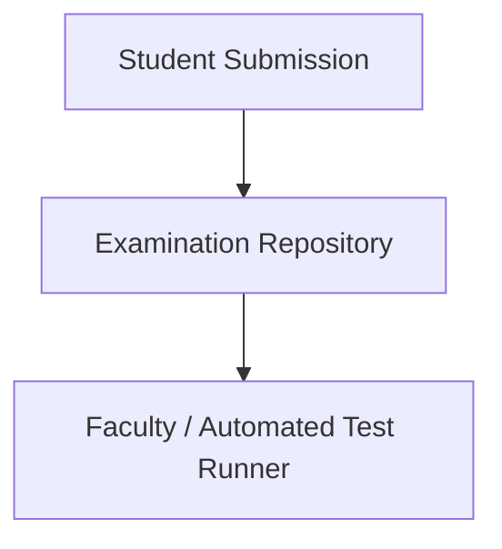
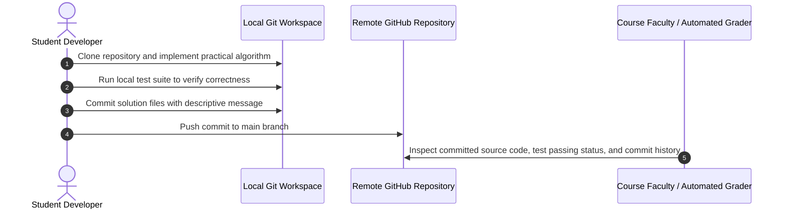

# End Semester Examination Lab — Engineering Repository
[]()
[]()
[]()
[]()

## Overview
An academic examination and laboratory evaluation repository designed for end-semester computer science and engineering coursework. Serves as a baseline submission template for programming practicals, data structure implementations, and software engineering exercises.

- **Problem Solved:** Academic evaluation staging and practical assessment tracking.
- **Target Users:** Academic evaluators, students, and course examiners.
- **Current Status:** Academic Submission Baseline.

## Features
- **Laboratory Practical Scaffold:** Structured foundation for laboratory exercises.
- **Clean Baseline:** Version controlled framework for algorithmic problem solving.

## Architecture


## User Flow


## Technology Stack
| Layer | Technology | Purpose |
|---|---|---|
| Platform | Git & GitHub | Code management and evaluation trail |
| Language | Polyglot (Java / Python / C++ / Web) | Problem implementation |

## Infrastructure
*Standard local developer environment.*

## Project Structure
```text
Endsemlab/
├── .gitignore           # Git ignore definitions
└── README.md            # Technical documentation
```

## Prerequisites
- Git >= 2.30
- Applicable programming compiler/runtime (Java JDK, Python 3, or Node.js)

## Environment Variables
*Not required.*

## Local Development Setup
1. Clone the repository:
   ```bash
   git clone https://github.com/Bhanutejanallamothu/Endsemlab.git
   cd Endsemlab
   ```
2. Implement assigned lab practical tasks.

## Docker Setup
*Not applicable.*

## Database Setup
*Not applicable.*

## API Documentation
*Not applicable.*

## Deployment
Submit commit SHA to academic evaluation portal.

## Security
- Academic integrity compliant; no shared credentials or proprietary university keys.

## Testing
Run project-specific test runners.

## Troubleshooting
- **Git Push Rejected:** Ensure local commits are rebased against `main`.

## Future Improvements
- Automated GitHub Actions unit test runner for immediate lab feedback.

## License
Academic coursework repository. All rights reserved by repository owner.
